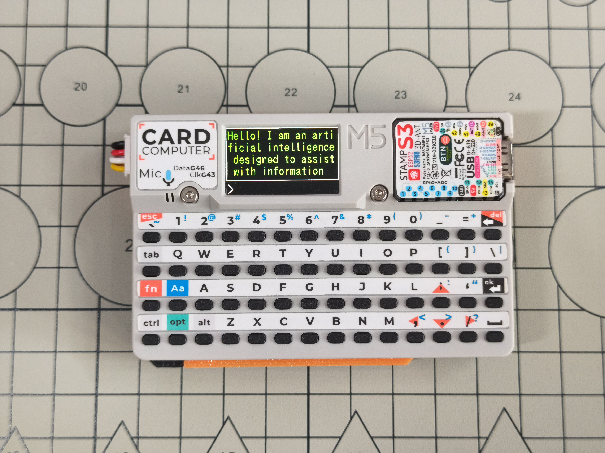
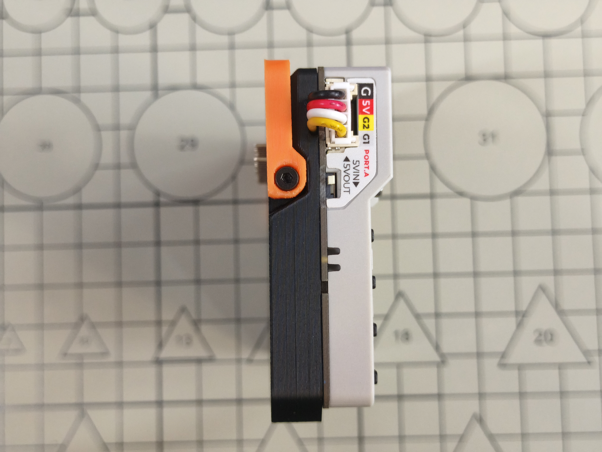

# CardputerLLM - Enclosure for Carputer && Module LLM

This print kit is designed for GOROman's LLMCardputer project. For details, visit: [GOROman/LLMCardputer](https://github.com/GOROman/LLMCardputer)

## Features

- Foldable stand
- Overall thickness matches the original Cardputer
- Retains all Module LLM interfaces

## BOM List

1. M5Stack Cardputer
2. GROVE HY2.0-4Pin Sensor Cable
3. M5Stack Module LLM
4. 3D Printed Enclosure L1
5. 3D Printed Enclosure S1
6. 3D Printed Enclosure M1
7. Hex Socket Head Cap Screw M2x5 (3 pcs)
8. Hex Socket Head Cap Screw M2x8 (1 pc)
9. Hex Socket Flat Head Screw M2x3 (1 pc)
10. Hex Socket Flat Head Screw M2x4 (2 pcs)

## Assembly Instructions

Install the Module LLM mainboard and speaker into the 3D printed enclosure L1. The wire connecting the speaker to the Module LLM needs to be extended.

Connect the GROVE sensor cable to the Module LLM. For specific wiring, please refer to: [GOROman/LLMCardputer](https://github.com/GOROman/LLMCardputer)

Use a Hex Socket Flat Head Screw M2x3 to install the 3D printed enclosure M1 onto the Cardputer.

Connect the Cardputer to the Module LLM.

Use 3 Hex Socket Head Cap Screws M2x5 and 1 Hex Socket Head Cap Screw M2x8 to install the 3D printed enclosure L1 onto the Cardputer.

Use 2 Hex Socket Flat Head Screws M2x4 to install the 3D printed enclosure S1 onto the 3D printed enclosure L1.

Assembly Complete.

## Additional Notes

To maintain the same thickness as the original Cardputer, the Module LLM header pins will protrude approximately 2.6 mm from the enclosure. For a flush surface, the header pins can be trimmed. Alternatively, deploying the stand will allow the CardputerLLM to sit stably on a desktop.

